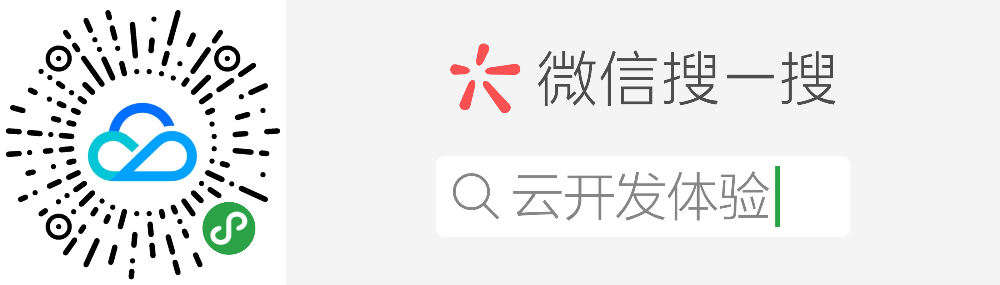

# 小程序基础场景及开发教学

本章，会介绍如何通过云开发去围绕小程序的一些基本的能力进行开发。主要包括以下能力：

- [用户管理](basic-tutorial/user.md)
- [小程序码生成](basic-tutorial/qr.md)
- [模板消息和统一服务消息](basic-tutorial/message.md)
- [微信支付](basic-tutorial/pay.md)

    
    
扫码体验

