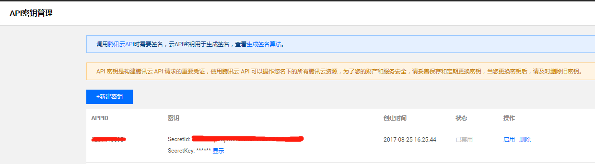
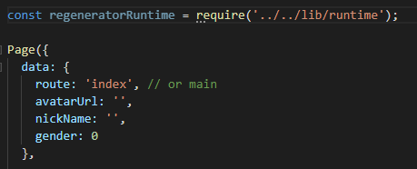

# 文档导读

> 本章，主要是对小程序·云开发相关文档进行的一下拆解和导读，希望开发者通过这一章能够更容易地在庞杂文档中，找到自己所需要的内容。

## 相关文档介绍

如果你希望使用云开发的能力，那们[小程序的文档](https://developers.weixin.qq.com/miniprogram/dev/api/report/wx.reportMonitor.html)，你需要关注的部份主要有三个，分别是 `框架`,  `API` 和 `小程序·云开发`。

`框架` 里面的 `开放能力` 部份，涉及到不少后台相关的流程，包括用户信息、消息、卡券等等，这里可以认证阅读了解大概的开发流程。

`API` 里面涉及到后台请求相关的，主要是 `开放接口` 这部份，包括登录、调用凭证、支付、模板消息、数据分析、卡券、小程序码、附近的小程序等等。一切本来在原有后台服务里发送请求的接口，基本都可以通过在云开发的 `云函数` 里面实现。

## 用户关心问题

`小程序·云开发` 文档里，则是所有与小程序·云开发相关的文档内容。下面会通过用户关心的的一些问题，介绍在哪里可以找到对应的文档。

### 1. 云开发是可以用于所有的小程序基础库吗？
是的，参考[兼容性问题](https://developers.weixin.qq.com/miniprogram/dev/wxcloud/basis/getting-started.html#%E5%85%BC%E5%AE%B9%E6%80%A7%E9%97%AE%E9%A2%98)进行配置。

### 2. 云开发的服务，可以在哪些端被调用？不同端会有哪些的调用能力的不同？
可以在小程序端和服务端调用。小程序端是通过内置的接口调用。而服务端，这里包括原有的服务和云函数，可以通过 `wx-server-sdk` 或者  `tcb-admin-node` 其中一个 node sdk 进行调用，前者是基于后者进行二次开发的。如果希望开发体验与小程序端一致，可采用 `wx-server-sdk`。小程序端的调用由于安全问题，会由较多的限制，而在服务端，则是可拥有管理员的权限（所以你会发现 `tcb-admin-node` 带有 `admin` 字眼，表示具有管理员权限）。

小程序端的 API 文档，可在 [小程序端 API 文档](https://developers.weixin.qq.com/miniprogram/dev/wxcloud/reference-client-api/) 查看。
服务端的 API 文档，可在 [云开发 Server API 文档](https://developers.weixin.qq.com/miniprogram/dev/wxcloud/reference-server-api/) 查看。

### 3. 在自己的服务器或者电脑本地的Node运行环境里（不是云开发）调用云开发的服务，要做哪些额外配置。

需要填入腾讯云的 `SecretId` 和 `SecretKey`。通过此[链接](https://www.qcloud.com/login/mp?s_url=https%3A%2F%2Fconsole.cloud.tencent.com%2Fcam%2Fcapi)登录小程序对应的腾讯云帐号，然后在[云API密钥](https://console.cloud.tencent.com/cam/capi) 里获取。

<p align="center">
    
    <p align="center">云API密钥</p>
</p>

获取密钥后，可使用 [`tcb-admin-node`](https://github.com/TencentCloudBase/tcb-admin-node)，在你的服务器里调用云开发的服务。

```js
// 初始化示例
const cloud = require('tcb-admin-node');

// 初始化资源
// 云函数下不需要 secretId和secretKey，但如果在自己的服务器里使用则需要
// env如果不指定将使用默认环境
cloud.init({
  secretId: 'xxxxx',
  secretKey: 'xxxx',
  env: 'xxx'
});

async function getUserData() {
  const db = cloud.database();
  return await db.collection('users').get(); // 默认获取20条数据
}

getUserData(); // 调用方法
```

### 4. 云函数的创建和依赖安装。
在 `project.config.json` 文件里，要添加以下字段，指向云函数的根目录。
```
{
   "cloudfunctionRoot": "./server/functions/"
}
```

那意味着，如果我们想建一个叫 `test` 的云函数，需要在 `./server/functions` 这个目录里新建 `test` 目录 ，并且要在 `test` 里安装依赖。千万不要在根目录安装依赖！

### 5. 云函数可以互相调用吗？
可以的，在 A 云函数里面，执行以下的语句就可以调用  B 云函数了，跟小程序端调用其实是一样的。

```js
const cloud = require('wx-server-sdk');
exports.main = async (event, context) => {
  const res = await cloud.callFunction({
    // 要调用的云函数名称
    name: 'B',
    // 传递给云函数的参数
    data: {
      x: 1,
      y: 2,
    }
  })
  return res.result;
}
```

### 6. 是否可以批量导入数据？
可以的，请参考 [数据库导入](https://developers.weixin.qq.com/miniprogram/dev/wxcloud/guide/database/import.html)

### 7. 数据库的在不同端的权限是怎么样的？
小程序端的权限没有服务端那么高，请参 [权限控制](https://developers.weixin.qq.com/miniprogram/dev/wxcloud/guide/database/permission.html)

### 8. 在小程序端，如何使用 `async/await` 语法？

在云函数里，由于 Node 版本最低是 8.9，因此是天然支持 `async/await` 语法的。而在小程序端则不然。在微信开发者工具里，以及 `Android` 端手机（浏览器内核是 QQ浏览器的 X5），`async/await`是天然支持的，但 `iOS` 端手机在较低版本则不支持，因此需要引入额外的 `polyfill`。可把这个 [`polyfill`](../assets/runtime.js) 文件引用到有使用 `async/await` 的文件当中。

<p align="center">
    
    <p align="center">在 js 里引入 polyfill</p>
</p>